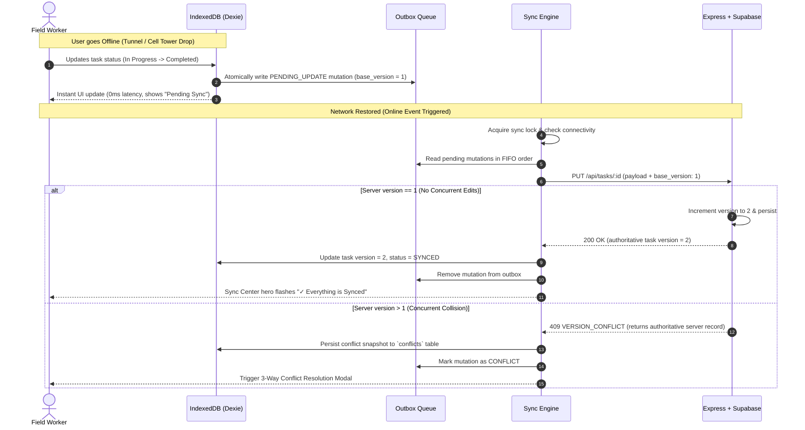

# FIELDNOTE — Offline-First Field Operations Workspace

[](https://algothon26-peach.vercel.app)
[](https://algothon26-peach.vercel.app)
[](https://algothon26-peach.vercel.app)
[](https://algothon26-peach.vercel.app)
[](https://supabase.com)

> **"Work anywhere. Sync when connected."**  
> An industrial-grade, offline-first workspace designed for field engineers, utility inspectors, and emergency responders operating under intermittent, degraded, or zero-connectivity environments.

---

## 🌐 Live Application

- **Production Frontend**: [https://algothon26-peach.vercel.app](https://algothon26-peach.vercel.app)
- **Problem Statement**: `ALG-WEB-02 — Offline-First Application`

---

## ⚡ Key Highlights & Core Capabilities

| Capability | How FIELDNOTE Delivers It |
|---|---|
| **Zero-Latency Interactions** | All project additions, task completions, and status changes write directly to **IndexedDB via Dexie.js** with immediate optimistic UI feedback. Zero network waiting. |
| **Deterministic Mutation Outbox** | Offline changes are queued in an atomic FIFO outbox with UUIDs, idempotency keys, and transaction-safe multi-store commits. |
| **Bi-Directional Sync Engine** | Single-flight orchestrator with mutex locks, bounded retries, and network connectivity listeners. Automatically reconciles cloud state when online. |
| **Optimistic Concurrency Control** | Every record carries a strict server `version`. Updates send `base_version`; out-of-order writes are rejected with `HTTP 409 Conflict`. |
| **User-Driven 3-Way Conflict Resolution** | Never silently overwrites user data. Preserves server and local snapshots side-by-side with **Keep Local**, **Keep Server**, and **Custom Merge** strategies. |
| **Offline App Shell & PWA** | Built-in Service Worker with precaching for instant startup without an internet connection. Fully installable on iOS, Android, macOS, and Windows. |
| **Industrial UI / UX** | Polished Linear-inspired dark interface with ambient cursor lighting, magnetic physical buttons, progress telemetry, and tactile feedback. |

---

## 🏗 System Architecture

```text
                           CLIENT BROWSER / PWA
┌────────────────────────────────────────────────────────────────────────┐
│  React 19 + Tailwind UI (Dashboard, Projects, Tasks, Sync Center)       │
│                                                                        │
│   [ UI Action ] ───► Repositories (projectRepo, taskRepo, outboxRepo)   │
│                             │                                          │
│                             ▼ (Atomic Dexie Transaction)               │
│               Local IndexedDB (fieldnote_db v3)                        │
│               ├── projects                                             │
│               ├── tasks                                                │
│               ├── outbox (Pending Mutations Queue)                     │
│               └── conflicts (Snapshot Diffs)                           │
│                             │                                          │
│   [ Network Event ] ◄───────┼──────────────────────────────────────────┤
│                             ▼                                          │
│                    Sync Manager & Engine                               │
│                    ├── Single Lock / Mutex Guard                       │
│                    ├── Dependency Ordering (Project before Task)       │
│                    ├── Bounded Exponential Retries                     │
│                    └── 409 Conflict Interceptor                       │
└─────────────────────────────┬──────────────────────────────────────────┘
                              │ HTTPS / REST (Idempotent Requests)
                              ▼
┌────────────────────────────────────────────────────────────────────────┐
│  Express Backend API                                                   │
│  ├── /api/health                                                       │
│  ├── /api/projects                                                     │
│  ├── /api/tasks (Optimistic Concurrency Guard: base_version checks)    │
│  └── /api/sync                                                         │
└─────────────────────────────┬──────────────────────────────────────────┘
                              │
                              ▼
┌────────────────────────────────────────────────────────────────────────┐
│  Authoritative Cloud Database (Supabase PostgreSQL)                    │
│  ├── projects (id, name, description, updated_at)                      │
│  └── tasks (id, project_id, title, status, priority, version)          │
└────────────────────────────────────────────────────────────────────────┘
```

---

## 🛠 Tech Stack

- **Frontend**: React 19, Vite, Tailwind CSS, Lucide Icons, Dexie.js (IndexedDB wrapper)
- **PWA & Offline Shell**: `vite-plugin-pwa`, Workbox, CacheStorage API, Web App Manifest
- **Backend**: Node.js, Express, `cors`, `pg` (node-postgres)
- **Database**: PostgreSQL hosted on **Supabase** with connection pooling
- **Testing**: Vitest (173 client & sync unit/integration tests) + Node test runner (41 backend tests)
- **Deployment**: Vercel (Frontend SPA + PWA) & Render / Railway (Express REST API)

---

## 🔄 The Offline Synchronization Lifecycle



---

## ⚖️ 3-Way Conflict Resolution Matrix

When another field worker or central dispatcher modifies the same task while someone is offline, FIELDNOTE **never silently overwrites data**. Both versions are preserved for side-by-side review:

| Strategy | Behavior | Under-the-Hood Action |
|---|---|---|
| **Keep Local** | Discards server changes and enforces field operator's offline edit. | Increments server version as base and resubmits the mutation with authoritative intent. |
| **Keep Server** | Discards local changes and accepts central cloud state. | Updates IndexedDB with server payload and purges pending outbox entry. |
| **Merge / Edit** | Field operator selects individual fields (Title, Priority, Status, Notes). | Creates a unified payload, binds it to current server version, and queues a clean mutation. |

---

## 🧪 Comprehensive Test Coverage (214 Tests Passing)

FIELDNOTE has been verified with comprehensive end-to-end integration and edge-case test suites:

```text
======================================================
FRONTEND TEST SUITES (Vitest)
======================================================
✓ 10 Outbox Mutation Queue & Coalescing Tests
✓ 10 Sync Engine & Reconciliation Tests
✓  9 Conflict Resolution (Keep Local / Server / Merge) Tests
✓  3 Complete End-to-End Integration Flows
✓ 141 Component, Repository & Unit Tests
------------------------------------------------------
Result: 173 PASSED, 0 FAILED (100% Passage)

======================================================
BACKEND TEST SUITES (Node / pg)
======================================================
✓ Health Check Probes
✓ Project REST CRUD Operations
✓ Task REST CRUD Operations
✓ Optimistic Concurrency HTTP 409 Guards
✓ Foreign Key & Tombstone Deletion Constraints
------------------------------------------------------
Result: 41 PASSED, 0 FAILED (100% Passage)
```

---

## 🚀 Local Quickstart Guide

### Prerequisites
- Node.js `v18+` or `v20+`
- npm `v9+`
- PostgreSQL database (or free Supabase project)

### 1. Clone the Repository
```bash
git clone https://github.com/baditra-ops/Algothon26.git
cd Algothon26
```

### 2. Configure Backend
```bash
cd backend
cp .env.example .env
npm install
```
Edit `backend/.env` with your database URL:
```env
PORT=5000
CLIENT_URL=http://localhost:5173
DATABASE_URL=postgresql://postgres:[PASSWORD]@[HOST]:5432/postgres
```

Run schema migration:
```bash
npm run db:migrate
```

Start the backend server:
```bash
npm run dev
```

### 3. Configure Frontend
In a new terminal:
```bash
cd frontend
cp .env.example .env
npm install
```

Start the Vite development server:
```bash
npm run dev
```
Open **[http://localhost:5173](http://localhost:5173)** in your browser.

---

## 🎥 Demonstration Walkthrough (Try it Yourself!)

1. **Seed Sample Data**:
   - Navigate to **Projects** and click **`Seed Demo Data`** in the top right.
2. **Experience Zero-Latency Local Edits**:
   - Go to **Tasks**, click the circle status button to advance tasks between `TODO` → `IN_PROGRESS` → `COMPLETED`. Edits reflect instantly.
3. **Simulate Offline Field Conditions**:
   - Open Chrome DevTools (`F12`) → **Network** tab → Check **`Offline`**.
   - Notice the ambient amber banner: *"Offline Mode — Working Locally"*.
   - Create a project or modify task priority. Everything saves seamlessly into IndexedDB.
4. **Inspect the Outbox Queue**:
   - Open **Sync Center** (`/sync-center`) to view your queued mutations waiting with timestamp, retry counter, and idempotency key.
5. **Reconnection & Reconciliation**:
   - Toggle DevTools Network back to **Online**.
   - Watch the dynamic glowing hero ring seamlessly transition to **`✓ Synced`** as mutations are reconciled with PostgreSQL.
6. **Install as a PWA**:
   - Click the install icon in your browser address bar to install FIELDNOTE as a standalone desktop or mobile application.

---

## 📄 License & Attribution

Developed for **Algothon '26** — *Problem Statement ALG-WEB-02: Offline-First Application*.  
Licensed under the [MIT License](LICENSE).